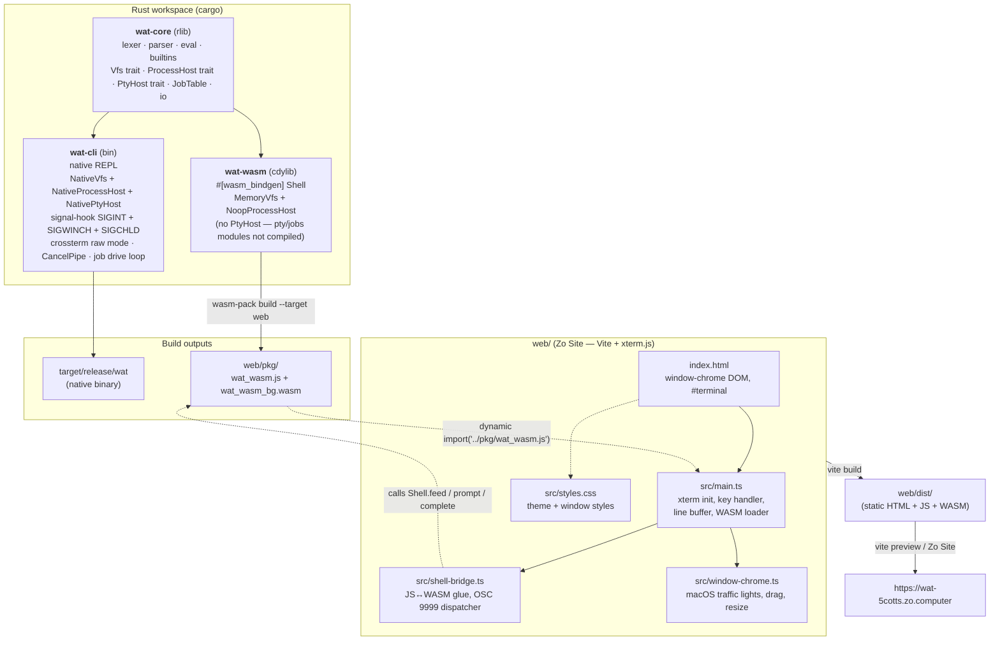
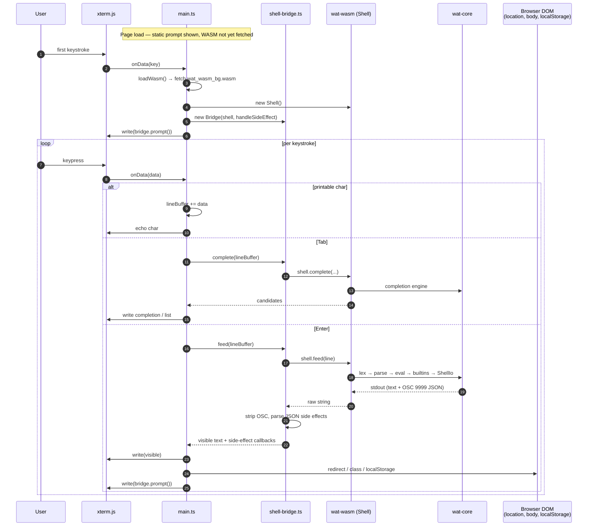

# wat

A POSIX-flavored shell written in Rust that runs natively and compiles to WebAssembly for the browser.

**Live site:** https://zo.pub/5cotts/wat

The native CLI (`wat-cli`) can run real external programs (`git`, `ls`,
`cargo`, anything on `PATH`) with live-streaming output and Ctrl-C
cancellation. Interactive foreground commands (`vim`, `less`, `htop`,
`python3`, `man`, etc.) run inside a real pseudo-terminal so full-screen
TUIs and line-editing work the same as in `bash` / `zsh`. Terminal
resizes propagate to the child via SIGWINCH. Job control — `Ctrl-Z`,
`jobs`, `fg`, `bg`, `kill %n`, and `cmd &` — works for PTY-routed single
commands. Shell expansions include command substitution `$(...)` /
`` `...` ``, integer arithmetic `$((...))`, and `${VAR:-default}`-style
parameter expansion, all of which also work in the browser shell. Control
flow — `if`/`elif`/`else`, `while`/`until`, `for`, `case`, with
`break`/`continue` and the `test`/`[` builtin — is supported and can be
typed across multiple lines.

wat is also scriptable: run a file (`wat script.sh args…`), a string
(`wat -c '…'`), or a `#!/usr/bin/env wat` shebang. It has positional
parameters (`$1`, `$@`, `$#`, `shift`, `set --`), shell functions with
`return`, here-documents (`<<EOF`, `<<-`, `<<<`), and the scripting
builtins `read`, `printf`, `eval`, `.`/`source`, `:`, and `set -e/-u/-x`.
See [Writing scripts for wat](#writing-scripts-for-wat).

It is **not** a login-shell replacement — see
[Use as a scratch shell on macOS](#use-as-a-scratch-shell-on-macos) below
for the explicit non-goals.

## First-time setup

All tooling is scoped to this directory — nothing is installed globally.

```sh
# Install wasm-pack into .cargo-tools/ (run once)
just bootstrap

# Add the WASM target (handled automatically by rust-toolchain.toml on first cargo build)
```

## Build

```sh
just build-native   # builds ./target/release/wat
just build-wasm     # builds web/pkg/ via wasm-pack
```

## Run

```sh
cargo run -p wat-cli          # dev REPL
just dev-web                  # Vite dev server at http://localhost:5173
```

## Test

```sh
just test   # cargo test --workspace + wasm-pack test --node
```

## CI

```sh
just ci   # fmt + clippy + test + wasm build + web build
```

## Project layout

```
crates/
  wat-core/   # pure shell logic (lexer, parser, eval, builtins)
  wat-cli/    # native REPL binary
  wat-wasm/   # wasm-bindgen cdylib for the browser
web/          # Vite + xterm.js Zo Site
```

## Architecture

### How the pieces fit together

`wat-core` is the source of truth — a Rust library (no `std::fs` in default features)
that knows how to lex, parse, evaluate, and complete shell input. Two thin shells
wrap it for their respective platforms: `wat-cli` for the terminal, `wat-wasm` for
the browser. The browser side is glued together by a small TypeScript layer that
hosts [xterm.js](https://xtermjs.org) and forwards keystrokes into the WASM module.



### What happens when you type a command

The browser never runs a real process — it hands every keystroke to xterm.js, lets
`main.ts` buffer a line, and on Enter forwards the full line into the WASM `Shell`.
The shell's stdout can contain ordinary text *and* `OSC 9999` escape sequences that
encode side effects (redirect, konami celebration, VFS persistence). `shell-bridge.ts`
strips and dispatches those before the visible output reaches xterm.



### File responsibilities

| File | Role in the running browser shell |
|---|---|
| `crates/wat-core/src/lexer.rs` | Tokenizes input into words, operators, quotes, and here-doc bodies. Brackets single-/double-quoted spans with internal markers so the expander/globber can honor quoting; collects `<<`/`<<-`/`<<<` bodies. |
| `crates/wat-core/src/parser.rs` | Turns tokens into the AST: simple commands, pipelines, compound commands (`if`/`while`/`until`/`for`/`case`/`{ }`), and function definitions. Reports `ParseError.incomplete` for open constructs (the multi-line-continuation hook). |
| `crates/wat-core/src/ast.rs` | AST node definitions — a recursive statement tree (`Command::Simple` / `Command::Compound` / `Command::FunctionDef`), redirects incl. here-docs/here-strings. |
| `crates/wat-core/src/eval.rs` | Walks the AST, runs pipelines, compound commands, and function calls, wires stdin/stdout, and honors `set -e/-u/-x`. `eval_capture_stdout` runs a sub-pipeline and captures stdout for command substitution. |
| `crates/wat-core/src/builtins/` | Each builtin (`echo`, `cd`, `ls`, `cat`, `test`/`[`, `break`/`continue`, easter eggs, …). |
| `crates/wat-core/src/builtins/test_cmd.rs` | The `test` / `[` builtin (string/integer/file conditions). |
| `crates/wat-core/src/vfs.rs` | In-memory virtual filesystem (the only VFS used in the browser). |
| `crates/wat-core/src/env.rs` | Environment vars + working directory. |
| `crates/wat-core/src/expand.rs` | Word expansion: `~`, `$VAR`/`${VAR}`/`$?`, positional params (`$1`/`$@`/`$#`), `${VAR:-…}`-style parameter expansion, quoting, command substitution `$(...)`/`` `...` `` and arithmetic `$((...))`, plus field splitting. `expand_word` is the pure (no-command) form; `expand_word_ctx` can run sub-pipelines. |
| `crates/wat-core/src/arith.rs` | Integer arithmetic evaluator (`i64`, C-like precedence) for `$((...))`. |
| `crates/wat-core/src/glob.rs` | Pattern matching for `*` / `?` / `[…]` (quote-protected metacharacters stay literal). |
| `crates/wat-core/src/complete.rs` | Tab-completion candidates. |
| `crates/wat-core/src/history.rs` | Command history (powers ↑/↓). |
| `crates/wat-core/src/io.rs` | `OutputSink` trait, `ShellIo` buffers + `emit_side_effect()` (writes `OSC 9999;{json}\x07`). |
| `crates/wat-core/src/process.rs` | `ProcessHost` / `ChildProcess` / `Signal` traits; `NativeProcessHost` (gated on `native-proc`) and `NoopProcessHost` (default, WASM). |
| `crates/wat-core/src/pty.rs` | `PtyHost` / `PtyChild` / `PtyDims` traits and `NativePtyHost` (gated on `native-pty`). WASM never compiles this — the module is gated out entirely so `portable-pty` stays out of the bundle. |
| `crates/wat-core/src/jobs.rs` | `JobTable`, `Job`, `JobState`, `JobPty` — stopped and background job tracking (gated on `native-pty`). |
| `crates/wat-core/src/shell.rs` | `Shell` facade — the entry point shared by CLI and WASM. `cancel_flag()` exposes the SIGINT atomic; `with_pty_host`, `spawn_pty`, `pty_eligible`, `is_background_cmd`, and `jobs()` drive the interactive PTY and job-control paths. |
| `crates/wat-wasm/src/lib.rs` | `#[wasm_bindgen]` wrapper exposing `Shell::new/prompt/feed/complete/history_at` to JS. |
| `crates/wat-cli/src/main.rs` | Native REPL (not used in browser). |
| `web/index.html` | DOM scaffold: window chrome, `#terminal` mount, loader. |
| `web/src/main.ts` | xterm setup, key handler, line buffer, history index, tab completion, lazy WASM loader, side-effect dispatcher, Konami detector. |
| `web/src/shell-bridge.ts` | JS↔WASM seam. Forwards calls to `Shell` and parses `OSC 9999` sequences out of stdout. |
| `web/src/window-chrome.ts` | macOS traffic-light buttons, dragging, resize handles, minimize/restore. |
| `web/src/styles.css` | Dark theme, window chrome styling, Konami flash animation. |
| `web/vite.config.ts` | Vite config (allowed hosts, HMR off for the Zo dev URL). |
| `web/pkg/wat_wasm.js` | wasm-pack glue: loads the `.wasm` and exports the `Shell` class. |
| `web/pkg/wat_wasm_bg.wasm` | Compiled `wat-core` + `wat-wasm` (~115 KB). |
| `web/zosite.json` | Zo Site manifest — dev entrypoint + publish config. |

### The OSC 9999 side-effect channel

WASM can't navigate the page, animate the DOM, or write to `localStorage` directly
from inside `wat-core`. Instead, builtins call `ShellIo::emit_side_effect()`, which
inlines an `OSC 9999;{json}\x07` escape into stdout. `shell-bridge.ts` is the only
piece of JS that knows about this protocol — it pulls those sequences out of the
output stream and turns them into real browser actions:

| Side effect | Emitted by | Handled in `main.ts` as |
|---|---|---|
| `{type: "redirect", url, delay_ms}` | builtins that "open" external sites | `window.location.href = url` |
| `{type: "konami_celebrate"}` | Konami detector (`__konami__` feed) | `body.classList.add("konami-celebrate")` + banner |
| `{type: "persist_vfs", snapshot}` | VFS persistence builtin | `localStorage.setItem("wat_vfs_snapshot", …)` |

This keeps `wat-core` pure Rust and host-agnostic — the same shell that runs in the
browser also runs in `wat-cli`, which simply ignores any `OSC 9999` it might emit.

## Use as a scratch shell on macOS

`wat-cli` can run real external programs, stream their output live,
honor Ctrl-C, and run full-screen TUI apps (`vim`, `less`, `htop`,
`man`, `python3`, etc.) inside a real pseudo-terminal. After `just
build-native`, drop the binary somewhere on your `PATH`:

```sh
just install-mac   # copies target/release/wat → ~/.local/bin/wat
```

Then `wat` from your terminal gets you a REPL where `git status`, `ls -la
| grep something | wc -l`, `cargo build`, `sleep 30` + Ctrl-C, and `vim
README.md` all work as expected.

**Do not make this your login shell.** wat explicitly does *not*
implement:

- **Startup files (`~/.watrc`), aliases, completion for external
  commands, arrays, `select`, subshells `( … )`, `[[ … ]]`.** Not in
  scope. (Functions, here-docs, arithmetic, positional parameters, and
  `set -e/-u/-x` *are* implemented — see
  [Writing scripts for wat](#writing-scripts-for-wat).)

Job control (`Ctrl-Z`, `fg`, `bg`, `jobs`, `kill %n`, `cmd &`) is
implemented for PTY-routed single commands. Exiting with stopped jobs
warns once (like bash) and SIGHUPs them on the second `exit`. See "Known
limitations" below.

Treat it as a credible *scratch* shell — fun to drive on purpose, not a
replacement for `zsh`.

### Known limitations

- **Piped commands (`cmd1 | cmd2 …`) do not participate in job control.**
  A `Ctrl-Z` while a pipeline is running suspends both `wat-cli` and all
  children together (same process group as the grandparent shell), which
  drops you back to the grandparent shell. Resuming with the grandparent's
  `fg` works as expected. Fixing this would require putting pipeline
  children in their own process group — out of scope.

- **Background PTY jobs whose output exceeds ~64 KB will block.** When a
  job is started with `&`, nobody reads from its PTY master. The child's
  writes will fill the slave pipe buffer and the child will stall. Redirect
  output to a file (via the piped path: `cmd > file.txt &` is not yet
  supported, but `cmd > file &` can be routed through the buffered path by
  using a redirect) if you need long-running background output capture.

- **Single command per background job.** `cmd1 | cmd2 &` is not supported.

### How job control works

`Ctrl-Z` (`0x1a`) is forwarded in raw mode through the outer PTY to the
inner PTY slave, where the terminal driver converts it to SIGTSTP for the
foreground process group (`sleep`, `vim`, etc.). wat-cli detects the stop
via a non-blocking `waitpid(WUNTRACED)` poll in the drive loop, registers
the stopped job in a `JobTable`, and prints `[N]+ Stopped <cmd>` before
returning to the REPL prompt.

`fg` sends SIGCONT to the job's process group and re-enters the PTY drive
loop. `bg` sends SIGCONT without re-entering. `kill [-SIG] %n` signals a
job's whole process group (`kill <pid>` targets a raw pid). Background jobs
(`cmd &`) skip the drive loop entirely; a SIGCHLD handler polls each
Running/Stopped job's specific PID (not `waitpid(-1)`, which would race the
foreground loop) and updates the table, mapping `WIFCONTINUED` to Running so
a `bg`/`fg` SIGCONT isn't misread as a kill. `Done`/`Exit` notifications
appear at the top of the next REPL prompt.

Typing `exit` while jobs are stopped warns `You have stopped jobs.` and is
cancelled; a second consecutive `exit` proceeds, sending SIGHUP+SIGCONT to
the stopped groups so they don't linger suspended after the shell exits.

### How PTY routing works

For each command typed at the prompt, wat-cli decides whether to spawn
inside a PTY (interactive raw-mode path) or run through the buffered
streaming path. The PTY path is used iff **all** of the following hold:

1. The input parses to a single-command pipeline (no `|`, no `;`, no
   `&&`/`||`) — with an optional trailing `&` for background. A compound
   command (`if`/`while`/`for`/`case`) is never PTY-routed.
2. The command has no redirects (no `<`, `>`, `>>`, `2>`).
3. The command name doesn't shadow a wat builtin.
4. The command name resolves on `PATH`.
5. wat-cli's own stdin is a real TTY.

Otherwise the existing buffered path runs — so capture-style callers,
scripts, pipelines, and redirection all behave the same as in Tier 1.
The routing rule lives in `Shell::pty_eligible` so it stays in sync
with the parser and the builtin set as both evolve.

When a command is routed to the PTY path with a trailing `&` (background),
the drive loop is skipped and the job is added to the job table immediately.
Foreground commands enter the drive loop and can be stopped with `Ctrl-Z`.

### Expansions

Each word on the command line is expanded before the command runs, in this
order: tilde → parameter (`$VAR`/`${VAR}`/`$?`/`$1`/`$@`) → command
substitution / arithmetic → field splitting → globbing.

- **Command substitution** — `$(cmd)` and `` `cmd` `` run `cmd`, capture its
  **stdout** (stderr still reaches the terminal), strip trailing newlines, and
  splice the result. They nest (`$(echo $(echo x))`) and may contain full
  pipelines (`$(ls | wc -l)`).
- **Quoting & field splitting** — an *unquoted* substitution's output is split
  on whitespace (space/tab/newline) into separate words, which are then
  globbed; a *quoted* one (`"$(cmd)"`) stays a single word with its spacing and
  newlines intact. Adjacent literals join the first/last split field, so
  `x$(echo 'a b')y` yields `xa by`. (`$VAR` itself is not field-split.)
- **Arithmetic** — `$((expr))` evaluates integer (`i64`) arithmetic with
  C-like precedence: `+ - * / %`, unary `-`/`+`, parentheses, and variables
  (bare `N` or `$N`; undefined/non-numeric → `0`). Overflow wraps; division or
  modulo by zero prints a diagnostic and yields an empty result. The result is
  always a single word.
- **Positional parameters** — `$0` (shell/script name), `$1`…`$9` and
  `${10}`+, `$#` (count), and `$@`/`$*` (all params; `"$@"` expands to one
  field per parameter). Set with `set -- a b c` and rotated with `shift`.
- **Parameter expansion** — `${VAR}`, and the operators `${VAR:-word}` /
  `${VAR:=word}` / `${VAR:?word}` / `${VAR:+word}` (the `:` forms also act
  on an empty value; drop the `:` to act only when unset), prefix/suffix
  trimming `${VAR#pat}` / `${VAR##pat}` / `${VAR%pat}` / `${VAR%%pat}`
  (glob patterns), and length `${#VAR}`. `${VAR:=word}` assigns back to the
  shell; `${VAR:?word}` reports an error when unset.
- **`$?`** after a command reflects that command's own exit status, not any
  substitution it contained.

**Variable assignments.** A word of the form `NAME=value` before the command
name is an assignment. On its own (`out=$(date)`, `x=5`) it sets a shell
variable; as a prefix (`FOO=bar cmd`) it sets the variable only in that
command's environment, reverted afterward. The right-hand side is expanded
(tilde, `$VAR`, `$(...)`, `$((...))`) but **not** field-split or globbed, so
`x=$(echo 'a  b')` keeps both spaces. Per POSIX, a prefix does not affect
expansion of the rest of the line: with `x=1`, `x=5 echo $x` prints `1`.

These are pure `wat-core` features, so they work identically in the browser
shell — an inner builtin runs against the in-memory VFS; an inner external
hits the no-op process host and yields empty output, exactly like a top-level
external in WASM. Nesting is capped (32 levels) to bound recursion.

**Quoting.** Single quotes are fully literal — `'$x'`, `'$(cmd)'`,
`'$((1+1))'`, `'~'`, and `'*'` are all passed through verbatim. Double
quotes allow `$`/`$(…)` expansion but suppress word splitting and globbing,
so `"$x"` is a single field and `"*"` stays literal. A quoted keyword
(`'if'`) is a command name, not the keyword.

### Control flow

The grammar (keywords are recognized only in command position, so `echo if`
still prints `if`):

```sh
if list; then list; [elif list; then list;]* [else list;] fi
while list; do list; done
until list; do list; done
for NAME [in word...]; do list; done
case word in (pat[|pat]...) list ;; ... esac
```

Examples:

```sh
if test -f config; then echo found; else echo missing; fi
for f in *.txt; do echo "$f"; done
i=0; while test $i -lt 3; do echo $i; i=$((i + 1)); done
case "$1" in start) run;; stop) halt;; *) echo "usage: ...";; esac
```

- **Conditions** are command lists; a branch/loop runs on exit status 0 (`while`)
  or non-zero (`until`). The `test` / `[` builtin provides string (`-z`, `-n`,
  `=`, `!=`), integer (`-eq -ne -lt -le -gt -ge`), and file (`-e -f -d`, via the
  VFS) tests, plus `!` negation.
- **`break` / `continue`** affect the innermost loop (single level). Loops poll
  the Ctrl-C flag between iterations, so an infinite loop is interruptible.
- **`case`** patterns are glob-matched (`*`, `?`, `[...]`), with `|` alternation
  and an optional leading `(`; the first matching arm runs.
- Compound commands run in the **current shell** (no subshell), so assignments
  and `cd` inside them persist.
- **Multi-line input**: an unfinished construct (or an unterminated quote /
  `$(`) shows a continuation prompt (`> `) and keeps reading until it parses;
  this works in the native REPL and the browser shell. `Ctrl-C` discards an
  in-progress command.

Like the expansions, this is pure `wat-core`, so it all works in the browser
shell too. Functions, `return`, brace groups `{ …; }`, and positional
parameters are also supported (see [Writing scripts for wat](#writing-scripts-for-wat)).
Not implemented: subshells `( … )`, `select`, `[[ … ]]`, and multi-level
`break N`.

## Writing scripts for wat

wat runs scripts as well as interactive input. Three ways to invoke it:

```sh
wat script.sh alice bob     # run a file; $1=alice, $2=bob, $0=script.sh
wat -c 'echo "$1"' x a b     # run a string; $0=x, $1=a, $2=b
echo 'echo hi' | wat         # read the script from stdin
```

A script can also start with a shebang and be executed directly:

```sh
#!/usr/bin/env wat
```

From an interactive session, `.`/`source file` runs a script in the
**current** shell, so the functions and variables it defines persist.

### Scripting features

- **Positional parameters** `$0 $1 … $# $@ $*`, `set -- a b c`, `shift [n]`.
- **Functions** — `name() { …; }` or `function name { …; }`; call like any
  command (`$1`, `$@` inside refer to the call's arguments). `return [n]`
  ends the function with status `n`.
- **Parameter expansion** — `${VAR:-default}`, `:=`, `:?`, `:+`, prefix/suffix
  trimming `#`/`##`/`%`/`%%`, and length `${#VAR}`.
- **Here-documents** — `<<EOF` (expanded body), `<<'EOF'` (literal body),
  `<<-EOF` (strips leading tabs), and here-strings `<<<word`.
- **Builtins** — `:` (no-op), `printf` (`%s %d %i %x %%`, `\n \t \r`,
  argument cycling), `read [-r] [NAME…]`, `eval`, `.`/`source`, plus
  `set -e` (errexit), `set -u` (nounset), and `set -x` (xtrace).

### Example

```sh
#!/usr/bin/env wat
set -e
greet() { printf 'hello, %s\n' "$1"; }
for name in "$@"; do
  case $name in
    -*) continue ;;
    *)  greet "$name" ;;
  esac
done
count=$#
echo "got ${count} arg(s); first=${1:-none}"
cat <<EOF
done at depth $count
EOF
```

Run as `wat greet.sh alice bob`:

```
hello, alice
hello, bob
got 2 arg(s); first=alice
done at depth 2
```

## Adding a builtin

1. Add a module in `crates/wat-core/src/builtins/`.
2. Register it in `crates/wat-core/src/builtins/mod.rs`.
3. Add integration tests in `crates/wat-core/tests/builtins.rs`.

## Adding an easter egg

Implement it as a builtin in `wat-core` (see the builtins guide above). For side effects that require browser APIs (redirect, animation), emit an OSC `9999` escape sequence from `io::emit_side_effect()` and handle the payload type in `web/src/shell-bridge.ts`.
